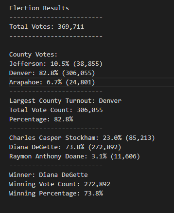
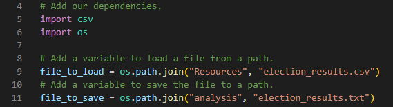

# Election_Analysis

## Overview of Election Audit

A Colorado Board of Elections employee has given the following tasks to complete the election audit of a local congressional election.
1. Calculate the total number of votes cast.
2. Get a complete list of candidates who received votes.
3. Calculate the total number of votes each candidate received.
4. Calculate the percentage of votes each candidate won.
5. Determine the winner of the election based on popular vote.

After these initial results the Board of Election asked for additional data to be included in the audit.
1. The voter turnout for each county
2. The percentage of votes from each county out of the total count
3. The county with the highest turnout

## Resources

- Data Source: election_results.csv
- Software: Python 3.6.1, Visual Studio Code, 1.38.1

## Election-Audit Results
The analysis of the election show that:

### Total Votes Cast:
- There were a total of 369,711 votes cast in the election
### Votes and Percentages per County:
- Number of votes for each county:
    - Jefferson: 38,855
    - Denver: 306,055
    - Arapahoe: 24,801
- Percentage of total votes fer each county:
    - Jefferson: 10.5%
    - Denver: 82.8%
    - Arapahoe: 6.7%
- County with the largest turnout:
    - Denver with 82.2% of the total number of votes and a turnout of 306,055 voters.

### Votes and Percentages per Candidate
- Number of votes for each Candidate:
    - Charles Casper Stockham: 85,213
    - Diana DeGette: 272,892
    - Raymon Anthony Doane: 11,606
- Percentage of total votes fer each Candidate:
    - Stockham: 23.0%
    - DeGette: 73.8% 
    - Doane: 3.1% 
- The winner of the election was:
    - Diana DeGette, who received 73.8% of the vote and 272,892 number of votes.

## Election Audit Summary

The script created for this Election Audit can be reused for any future upcoming elections. With each new election include the .csv file in the resources folder and create a new name for the file. Once you've done so, locate the file path on line 9 and change the current file .csv file "election_results.csv" with the name of the new .csv file.
